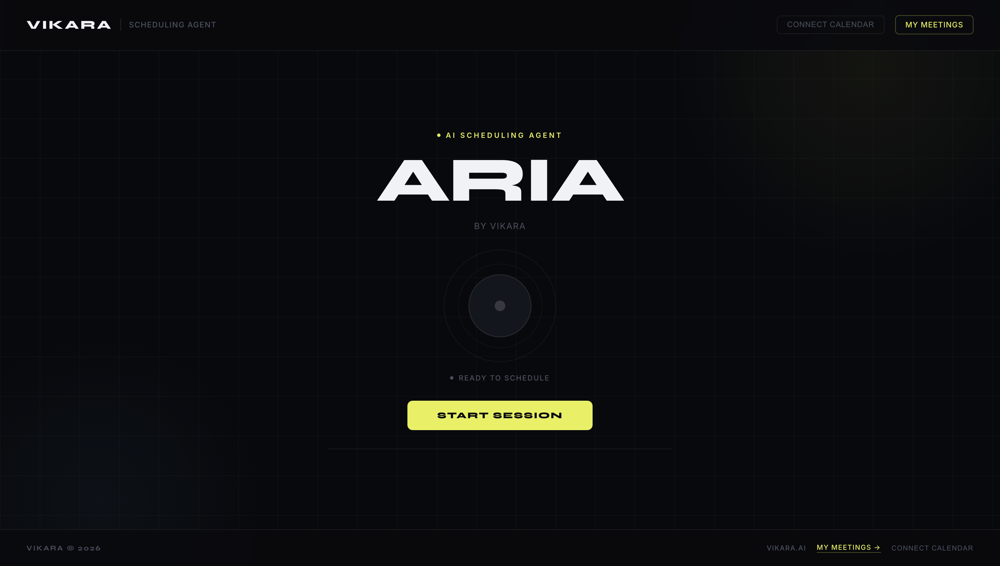
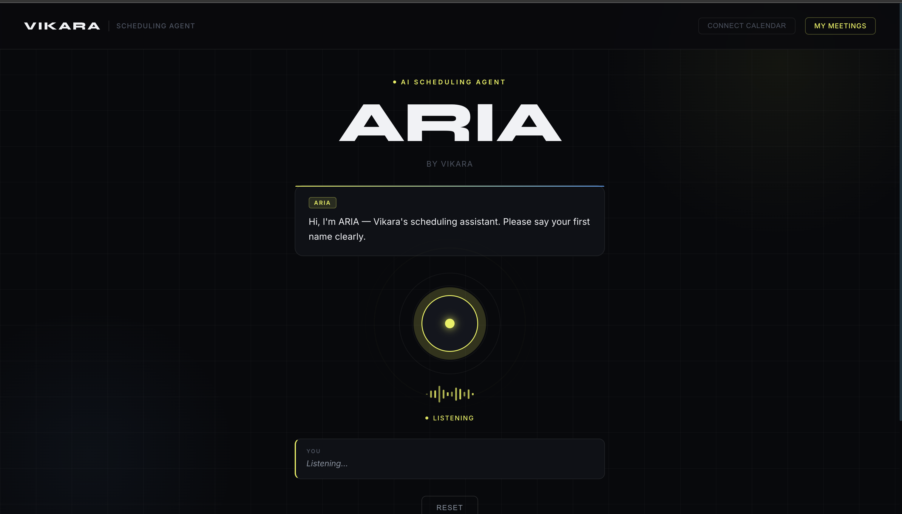
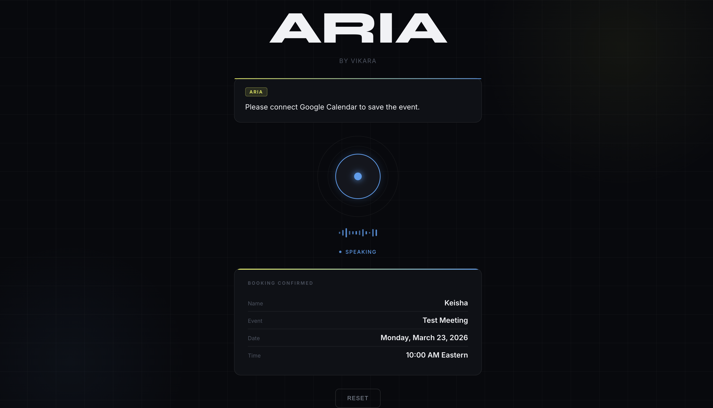

# ARIA — AI Voice Scheduling Agent by Vikara

> A production-ready voice agent that books real Google Calendar events through natural conversation.

---

## 🔗 Live Demo

**Deployed URL:** https://voice-scheduling-agent-nf3n2k6oa-kishita-pakhranis-projects.vercel.app/

> ⚠️ Use **Chrome or Edge** — voice recognition requires a Chromium-based browser.

---

## 🎥 Demo Video

[Watch the full demo on YouTube](https://youtu.be/UHBW0zQfOGA)

_The video shows a complete flow: connecting Google Calendar, speaking with ARIA, and the event appearing live in Google Calendar._

---

## 📸 Screenshots

### ARIA Voice Agent — Idle State



### ARIA Listening



### Booking Confirmed



---

## 🧪 How to Test the Agent

### Prerequisites

- Chrome or Edge browser
- A Google account

### Steps

1. **Open the deployed URL** in Chrome or Edge

2. **Connect Google Calendar**
   - Click **"Connect Calendar"** in the top navigation
   - Sign in with your Google account
   - Click **Allow** when prompted
   - You will be redirected back and see **"Calendar connected"** in green

3. **Start a voice session**
   - Click the **"Start Session"** button
   - Allow microphone access when the browser asks

4. **Speak naturally with ARIA**
   - ARIA will ask for your **name** — say it clearly
   - ARIA will ask for a **date** — say something like _"next Monday"_ or _"April 10th"_ (weekdays only)
   - ARIA will ask for a **time** — say something like _"2 PM"_ or _"10 AM"_ (business hours 9 AM–5 PM only)
   - ARIA will ask for a **meeting title** — say something like _"Team Standup"_ or _"Client Call"_
   - ARIA will **read back the details** — say _"yes"_ or _"sounds good"_ to confirm

5. **Event is created**
   - A success banner appears with a link to the event
   - Open Google Calendar to verify the event was created at the correct time

6. **Manage meetings**
   - Click **"My Meetings"** in the navigation to view, reschedule, or cancel events

### Validation Rules

- Meetings can only be scheduled on **weekdays (Mon–Fri)**
- Meetings can only be scheduled during **business hours (9 AM – 5 PM Eastern)**
- ARIA will ask again if you provide an invalid date or time

---

## 📅 Calendar Integration

### Provider

Google Calendar API v3

### Authentication Flow

1. User clicks "Connect Calendar" which redirects to `/api/calendar/auth`
2. The app initiates Google OAuth 2.0 with `calendar.events` scope
3. Google redirects back to `/api/calendar/callback` with an authorization code
4. The code is exchanged for an access token
5. The access token is stored in the browser's `localStorage`
6. All subsequent calendar operations use this token

### Event Creation

- **Endpoint:** `POST /api/calendar/create`
- **Timezone:** `America/New_York` — times are interpreted as Eastern Time
- **Duration:** 1 hour (fixed)
- **Reminders:** Email 24 hours before, popup 30 minutes before
- The event is created on the user's **primary calendar**

### Reschedule & Cancel

- **Reschedule:** `PATCH` call to Google Calendar Events API updates the existing event's start and end time
- **Cancel:** `DELETE` call removes the event from Google Calendar entirely
- Both operations validate business hours before executing

### Data Storage

Meeting metadata (title, date, time, Google event ID, event link) is stored in `localStorage` under `ariaMeetings` to power the My Meetings dashboard.

---

## 🛠 Tech Stack

| Layer              | Technology                                    |
| ------------------ | --------------------------------------------- |
| Framework          | Next.js 14 (Pages Router)                     |
| LLM / Conversation | Groq (Llama 3.3 70B)                          |
| Speech-to-Text     | Web Speech API (browser-native)               |
| Text-to-Speech     | ElevenLabs → fallback to Web Speech Synthesis |
| Calendar           | Google Calendar API v3 (OAuth 2.0)            |
| Deployment         | Vercel                                        |

---

## 🏗 Architecture

```
User speaks
    │
    ▼
Web Speech API (STT)
    │
    ▼
State Machine (chat.js)
    │  Extracts: name, date, time, title
    │  Validates: weekdays only, 9AM–5PM only
    │
    ▼
Groq LLM (Llama 3.3 70B)
    │  Entity extraction per step
    │
    ▼
Google Calendar API
    │  Creates event in Eastern timezone
    │
    ▼
Web Speech Synthesis (TTS)
    │
    ▼
User hears confirmation
```

---

## 💻 Run Locally

### Prerequisites

- Node.js 18+
- Chrome or Edge browser
- A Google Cloud project with Calendar API enabled

### 1. Clone the repo

```bash
git clone https://github.com/kishita1810/Voice-Scheduling-Agent.git
cd Voice-Scheduling-Agent/frontend
```

### 2. Install dependencies

```bash
npm install
```

### 3. Set up environment variables

```bash
cp .env.example .env.local
```

Edit `.env.local` with your keys:

```
GROQ_API_KEY=gsk_...
GOOGLE_CLIENT_ID=your_client_id.apps.googleusercontent.com
GOOGLE_CLIENT_SECRET=GOCSPX-...
NEXTAUTH_URL=http://localhost:3000
```

### 4. Get your API keys

| Key                    | Where to get it                                                  |
| ---------------------- | ---------------------------------------------------------------- |
| `GROQ_API_KEY`         | https://console.groq.com → API Keys (free)                       |
| `GOOGLE_CLIENT_ID`     | https://console.cloud.google.com → APIs & Services → Credentials |
| `GOOGLE_CLIENT_SECRET` | Same as above                                                    |

### 5. Configure Google OAuth

In Google Cloud Console:

- Enable **Google Calendar API**
- Create OAuth 2.0 credentials (Web application)
- Add authorized redirect URI: `http://localhost:3000/api/calendar/callback`
- Add your email as a test user in OAuth consent screen

### 6. Start the dev server

```bash
npm run dev
```

Open **http://localhost:3000** in Chrome.

---

## 🚀 Deployment

**Frontend:** Deployed on [Vercel](https://vercel.com)

- Root directory set to `frontend/`
- Environment variables configured in Vercel dashboard

---

## 👤 Built By: Kishita Pakhrani

- GitHub: [@kishita1810](https://github.com/kishita1810)
